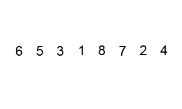

# Divide-and-Conquer Sorting Algorithms

Now we’re cookin’ with gas! The two algorithms that use the “divide-and-conquer” method — merge sort and quick sort — are efficient and widely used in programming. Yes, they’re a bit more difficult to understand and implement, but you’re more likely to encounter them out in the wild.

### TOPICS

- Merge Sort
- Quick Sort

# Learning Objectives

1 of 19

By the end of this lesson, you'll be able to:

- Describe how merge sort and quick sort work.
- Explain the space and time complexities of merge sort and quick sort.
- Identify when to use merge sort or quick sort in a given scenario.

# Go All Julius Caesar on Your Data Sets

2 of 19

In Ancient Rome, Julius Caesar handily conquered France by dividing it up into three parts, then conquering each part one by one. But why should he get to have all the divide-and-conquer fun? As it turns out, you too can use divide and conquer on your data with merge and quick sorts. (For the record, General Assembly would never suggest you go and conquer France.)

Merge and quick sorts are comparison algorithms that solve problems with recursion.

Remember recursion? Recursive functions call themselves and repeat a certain action until a specific condition is reached. It’s like using the algorithm to solve itself. That might feel like cheating, but it’s not — as long as we make sure the algorithm has a way out of the recursion. And we wouldn’t want infinite recursion, would we? (And no, we will never stop making recursion jokes.)

The gist of divide-and-conquer algorithms is pretty simple. If your data set is too big to sort initially, chop it into multiple, smaller pieces until they’re small enough to sort on their own. That’s where the recursion comes in — repeated dividing and sorting until the data set is sorted.

Take this pile of Legos, for instance. You want to sort them by color, but you don’t feel like doing it all in one batch. Let’s use a divide-and-conquer approach here. To start off, you’d split them in half, then in half again, and so on until you have individual Legos. This is the “divide” part. Then, you can sort the individual pieces and put it all back together.

I’ve conquered the sort!

In this lesson, we’ll cover two very important algorithms that use a divide-and-conquer approach: merge sort and quick sort.

# Meet Merge Sort

3 of 19

First, let’s talk about **merge sort**. Merge sort uses an extremely efficient application of “divide and conquer” to sort lists of elements. It takes an array and splits it in half over and over again until it’s small and sorted (there’s the divide part). Then, it merges small sorted pieces together on their way back up (that’s how it conquers). Sound familiar? It’s recursion!

Merge sort is built on two premises:

- The easiest list to sort? A single-item list.
- Creating one large sorted array by merging two smaller sorted arrays? Not hard to do.

# The Components of a Merge Sort

4 of 19

Merge sort is actually two algorithms — the **merge sort** algorithm and the **merge** algorithm — that work together to achieve the same goal. The two algorithms each work in a different phase of the process.

- **Phase 1:** Split the array in half until you can’t anymore (aka, divide). This is accomplished with the merge sort algorithm.
- **Phase 2:** Merge those pieces back together (aka, conquer). This is done with the merge algorithm (sometimes called the “merge helper” function).

# Knowledge Check 1

5 of 19

Which part of merge sort uses recursion?

The merge sort algorithm divides the data set in half until it reaches a base case, when it can't divide it anymore. Hello, recursion! Let's see how that works next.

# Divide: The Merge Sort Algorithm

6 of 19

Like any recursive function, the merge sort algorithm is defined by a base case and a recursive case:

| Case               | **Condition**                         | **Action**                                                                                                                                                                                   |
| ------------------ | ------------------------------------- | -------------------------------------------------------------------------------------------------------------------------------------------------------------------------------------------- |
| **Base case**      | The array is one element or shorter.  | Ta-da! Sorted! Return the array.                                                                                                                                                             |
| **Recursive case** | The array is longer than one element. | Divide the array into two pieces. Call itself again on both the left and right sides you just created. Keep doing this until you have single-element arrays. The base case has been reached! |

Notice that the merge sort algorithm divides arrays until they’re down to single-item arrays but does not check to see if those arrays are sorted. It relies on the fact that zero- or single-element arrays are fundamentally sorted and only returns those.

# Conquer: The Merge Algorithm

7 of 19

Reminder: The merge algorithm is different from the merge sort algorithm.

The merge algorithm, or merge helper function, takes two sorted arrays, compares them, and sorts them into a results list. It keeps doing this until you end up with a large, sorted array. Unlike the merge sort algorithm, the merge algorithm is not recursive.

Here’s the basic process of the merge algorithm. It starts with the sorted single-element arrays already created by its bestie, the merge sort algorithm:

1. Start at the beginning of two arrays of items.
2. Compare the first item from each array to each other.
3. Whichever value is less, copy it to a results list.
4. Move on to the next item in the array that just gave its first element to the results list.
5. Repeat Steps 1–4 until you have all of the elements from both arrays in the results list.

# Merge Sort’s Time Complexity

8 of 19

The two components of merge sort have two different time complexities:

- The non-recursive merge algorithm is an `O(N)` operation — not super efficient. Think about it: Every time you make a comparison, you move one value into the results list. You have to do this N times for each value that you’re merging.
- The recursive merge sort algorithm takes `O(log(N))` time. This is speedy! The number of elements can increase a lot without the complexity increasing very much at all.

To get the overall complexity of merge sort, we multiply `O(log(N))` and `O(N)` to get `O(N log(N))`.

# Knowledge Check 2

9 of 19

What is merge sort’s space complexity?

`O(N)` - The merge algorithm creates a separate "results array" as the data is being merges. That means it's an out-of-place sort and uses `O(N)` space complexity.

# Meet Quick Sort

10 of 19

The second type of divide-and-conquer sort is the **quick sort**. It differs from merge sort in how it approaches the divide phase.

Merge sorts divide an array into two pieces, while quick sorts divide an array into three parts. (Just like France after Julius Caesar got done with it!)

The parts are:

- The **pivot** (a single element).
- The **left partition**, an array containing numbers lower than the pivot.
- The **right partition**, an array containing numbers higher than the pivot.

After this, the pivot is considered sorted, as it’s a single element. Now, we need to recursively call quick sort on the partitioned array on either side of the pivot in order to sort those elements.

