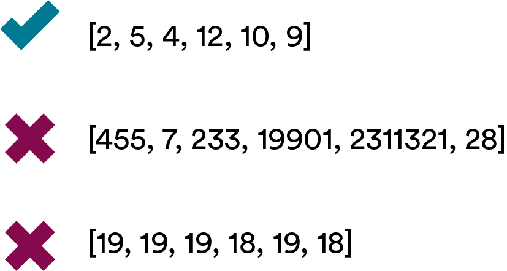
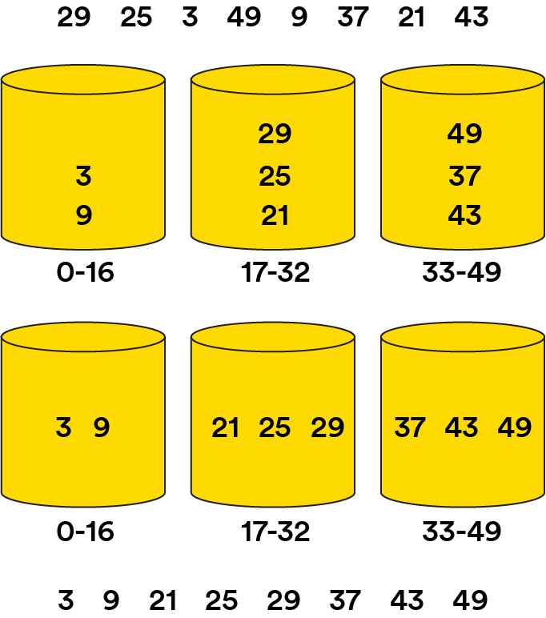

# Distribution Sorting Algorithms

You’ve graduated to the second important sorting method in computer science: distribution sorting! In this lesson, we’ll learn about two essential algorithms that use the distribution sort method.

### TOPICS

- Distribution Sorting
- Bucket Sort
- Radix Sort

# Learning Objectives

1 of 15

By the end of this lesson, you'll be able to:

- Explain how bucket and radix sorts work.
- Identify scenarios in which bucket and radix sorts should be used.
- Describe the time complexity of bucket sort.
- Implement bucket sort.

# Knowledge Check 1

2 of 15

Quick refresher: How does the distribution sorting method differ from the comparison sorting method?

Distribution sorts assign elements to certain categories based on common characteristics, while comparison sorts compare individual elementsin order to sort them.

# Visualize It

3 of 15

Imagine that you’re a teacher grading your students’ essays. You’re dividing the essays into piles based on their letter grade: A, B, C, D, or F.

In order to sort the essays by grade, you don’t need to compare one essay to another. Maybe the essays were evenly distributed across each letter grade, or maybe every student got a B — it doesn’t matter! You just need to know each essay’s grade in order to put it in the correct pile. That’s how **distribution sort** works.

# Knowledge Check 2

4 of 15

After you divide your students’ essays by letter grade, you have 10 essays in the B pile with these grades:

`[87, 84, 89, 84, 82, 85, 80, 88, 81, 84]`

Now, you want to sort all of those essays by their numerical grade. What type of sort would you use?

**Answer:** Comparison sort - A comparison sort makes more sense here, as you'd be comparing one grade to another in order to sort them. Distribution sorts are often used in conjunction with comparison sorts.

# Types of Distribution Sorts

5 of 15

In this lesson, we’ll cover two common implementations of the distribution sort method: **bucket sort** and **radix sort**.

- **Bucket sort** is a lot like the essay-grading scenario we just explored. It sorts elements into buckets based on their value and then uses another method to sort the elements within those bins. It can be used for integers or strings.
- **Radix sort** operates in basically the same way as bucket sort but is only used for integers.

# Makin’ Buckets

6 of 15

For both bucket and radix sorts, the most important thing you need to decide is: How many buckets should there be?

The answer? It depends on your data set. If you were sorting a lot of elements alphabetically, 26 buckets (one per letter) might work. Or, if you were sorting numbers with radix sort, 10 buckets (one for each digit) could be a good starting place.

**A general rule of thumb:** If there’s no one obvious way to create your buckets, use the square root of the number of items you’re sorting. So, if you have an array of 100 elements, 10 buckets would be appropriate.

# When to Use Bucket Sort

7 of 15

Bucket and radix sorts are most useful when you have a relatively dense range of numbers. “Dense” just means that the values in your starting array are relatively close together.

However, you don’t want your data set to be too dense. If your data set is very dense (i.e., its values are all the same or very similar), it would all be sorted into one bucket. This makes bucket sort’s efficiency a slow `O(N^2)`!

# How Bucket Sort Works

8 of 15
Here’s the general idea of how bucket sort works:

1. Start with your initial array; let’s say we have `[29, 25, 3, 49, 9, 37, 21, 43]`.
2. Set up an array of initially empty “buckets.” Because this array contains eight elements, we’ll use three buckets to start: Bucket 1, `0-16`; Bucket 2, `17-32`; Bucket 3, `33-49`.
3. Go over the original array and scatter each object in its bucket: Bucket 1, `[3, 9]`; Bucket 2, `[29, 25, 21]`; Bucket 3, `[49, 37, 43]`.
4. Sort each bucket: Bucket 1, `[3, 9]`; Bucket 2, `[21, 25, 29]`; Bucket 3, `[37, 43, 49]`.
5. Gather: Go through the buckets sequentially and gather everything back into the original single array.

# Knowledge Check 3

9 of 15

Can you guess bucket sort’s Big O space efficiency?

`O(N)` - Because bucket sort creates an entirely new array for the sorted values, it has O(N) space efficiency. This should sound like another algorithm we met recently - merge sort!

#
