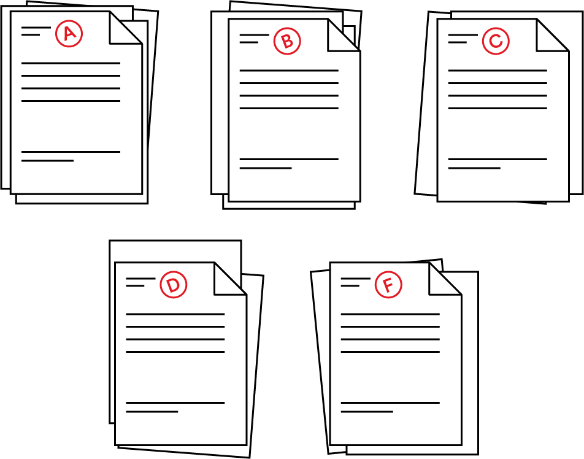

# Distribution Sorting Algorithms

You’ve graduated to the second important sorting method in computer science: distribution sorting! In this lesson, we’ll learn about two essential algorithms that use the distribution sort method.

### TOPICS

- Distribution Sorting
- Bucket Sort
- Radix Sort

# Learning Objectives

1 of 15

By the end of this lesson, you'll be able to:

- Explain how bucket and radix sorts work.
- Identify scenarios in which bucket and radix sorts should be used.
- Describe the time complexity of bucket sort.
- Implement bucket sort.

# Knowledge Check 1

2 of 15

Quick refresher: How does the distribution sorting method differ from the comparison sorting method?

Distribution sorts assign elements to certain categories based on common characteristics, while comparison sorts compare individual elementsin order to sort them.

# Visualize It

3 of 15

Imagine that you’re a teacher grading your students’ essays. You’re dividing the essays into piles based on their letter grade: A, B, C, D, or F.

In order to sort the essays by grade, you don’t need to compare one essay to another. Maybe the essays were evenly distributed across each letter grade, or maybe every student got a B — it doesn’t matter! You just need to know each essay’s grade in order to put it in the correct pile. That’s how **distribution sort** works.

# Knowledge Check 2

4 of 15

After you divide your students’ essays by letter grade, you have 10 essays in the B pile with these grades:

`[87, 84, 89, 84, 82, 85, 80, 88, 81, 84]`

Now, you want to sort all of those essays by their numerical grade. What type of sort would you use?

**Answer:** Comparison sort - A comparison sort makes more sense here, as you'd be comparing one grade to another in order to sort them. Distribution sorts are often used in conjunction with comparison sorts.

# Types of Distribution Sorts

In this lesson, we’ll cover two common implementations of the distribution sort method: **bucket sort** and **radix sort**.

- **Bucket sort** is a lot like the essay-grading scenario we just explored. It sorts elements into buckets based on their value and then uses another method to sort the elements within those bins. It can be used for integers or strings.
- **Radix sort** operates in basically the same way as bucket sort but is only used for integers.

#
