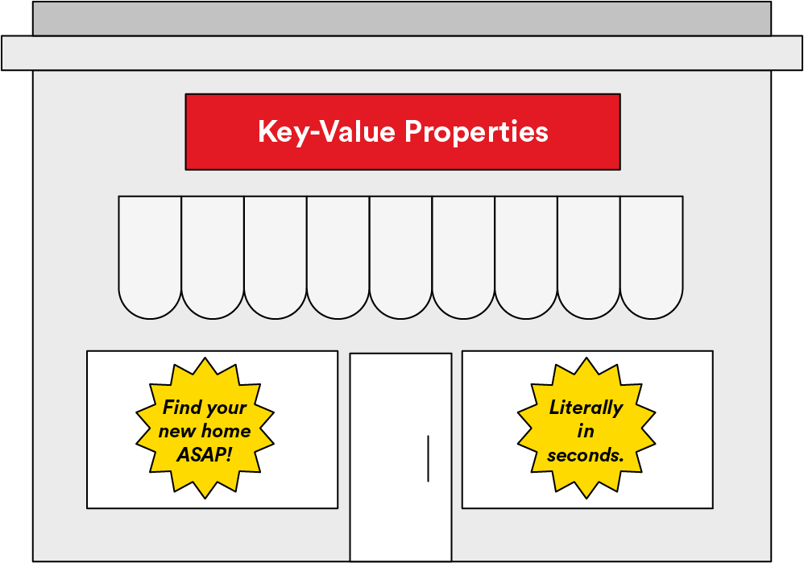
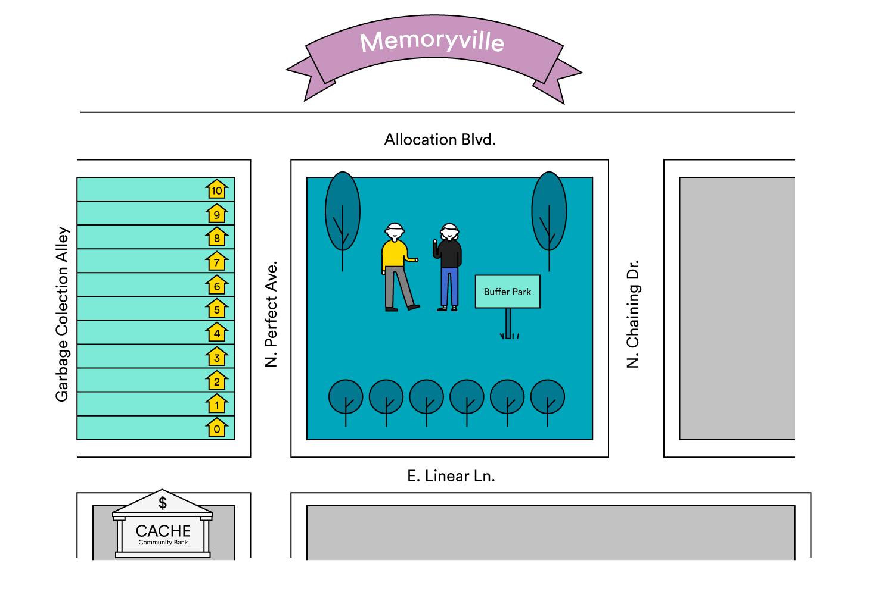
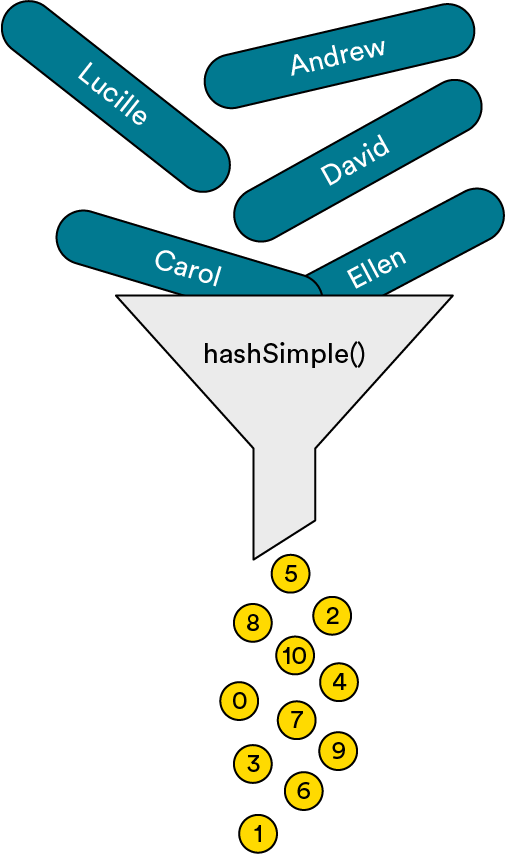
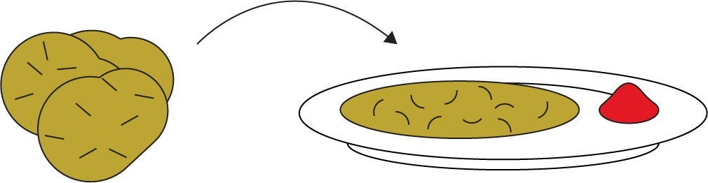

# Introduction to Hash Tables

Take a journey with us to the very quaint (and very fictional town) of Memoryville. We’ll learn about how hash tables, an important and complex data structure, solved a crisis of space and usage for the small town — and could do the same in computer science.

### TOPICS

- Hash Tables and the Hash Function
- Collisions
- Chaining

# Learning Objectives

By the end of this lesson, you'll be able to:

- Define hash functions and hash tables.
- Articulate the benefits of hash tables, in particular as they relate to speed of data access.
- Define collisions and how to resolve them.

# A History of Hashing: Memoryville

Many years ago, in the small but high-tech town of Memoryville, a serious problem began to emerge in the real estate market. The traditional methods that locals had been using to find places to live were time-consuming, and people were so dissatisfied that they started moving elsewhere.

So, the city created a co-op called Key-Value Properties and conscripted several local computer scientists to be on its board. These board members were promised ample funding if they could speed up the house-hunting process for current and future Memoryville residents.



# Their Goal: Find Addresses, Stat

Key-Value Properties was given the best land in the city: right downtown on the east side of Perfect Avenue, across the street from a park. It built 11 state-of-the-art cottages with sustainable micro-farms in their backyards. It was the pride of Memoryville!

Because they were all computer scientists, the Key-Value board members naturally decided that the addresses would start with `0`. And, because there’s a park on the other side of the street, it used both even and odd addresses from `0` to `10`, even though the houses were all in a row. (The board didn’t ask the post office about any of this.)



# Everybody Gets a House!

Residences were available on a first-come, first-served basis and were open to all. However, because of the strict requirement that house searching happen quickly, residents were not allowed to choose a specific cottage — they had to agree to leave that to the co-op board.

As the Key-Value Properties board was made up entirely of computer scientists, it had a strange way of determining where to place residents. It used a function, called `hashSimple()`, that took the name of the resident as an argument and returned a number between `0` and `10`. That was the address assigned to each new resident. The board designed the function to be simple so that the process of finding homes for new residents could be as quick and painless as possible.


# The Function

The board’s function takes the resident’s first name and assigns each character an integer value: `1` for A, `2` for B, `3` for C, and so on, all the way up to `26` for Z.

Then, it adds the values for each character in the name together. And, because it needs to produce an address between `0` and `10`, it performs the modulus operation `sum % 11`. Voilà! The result is an integer address between `0` and `10`!

# And We Shall Call It: Hash

Because that function took something recognizable, chopped it up, and scrambled the pieces to produce an output that was wonderful (but not necessarily recognizable as the input), the board called it a hash function. Yes, kind of like when you take a potato and chop it up to make a hash brown.



Delicious? Yes. Related to the original? Only partially.

# Hashing It output

The first 11 residents to sign up were April, Carol, Cary, David, Ellen, Jim, Joel, Lucille, Mary, Ruby, and Sara. Key-Value Properties ran those names through its `hashSimple()` function:

```js
((hashSimple('April') == (1 + 16 + 18 + 9 + 12) % 11) == 56 % 11) == 1;
// => April goes at 1 N. Perfect Ave
((hashSimple('Carol') == (3 + 1 + 18 + 15 + 12) % 11) == 49 % 11) == 5;
// => Carol goes at 5 N. Perfect Ave
((hashSimple('Cary') == (3 + 1 + 18 + 25) % 11) == 47 % 11) == 3;
// => Cary goes at 3 N. Perfect Ave
((hashSimple('David') == (4 + 1 + 22 + 9 + 4) % 11) == 40 % 11) == 7;
// => David goes at 7 N. Perfect Ave
((hashSimple('Ellen') == (5 + 12 + 12 + 5 + 14) % 11) == 48 % 11) == 4;
// => Ellen goes at 4 N. Perfect Ave
((hashSimple('Jim') == (10 + 9 + 13) % 11) == 32 % 11) == 10;
// => Jim goes at 10 N. Perfect Ave
((hashSimple('Joel') == (10 + 15 + 5 + 12) % 11) == 42 % 11) == 9;
// => Joel goes at 9 N. Perfect Ave
((hashSimple('Lucille') == (12 + 21 + 3 + 9 + 12 + 12 + 5) % 11) == 74 % 11) ==
  8;
// => Lucille goes at 8 N. Perfect Ave
((hashSimple('Mary') == (13 + 1 + 18 + 25) % 11) == 57 % 11) == 2;
// => Mary goes at 2 N. Perfect Ave
((hashSimple('Ruby') == (18 + 21 + 2 + 25) % 11) == 66 % 11) == 0;
// => Ruby goes at 0 N. Perfect Ave
((hashSimple('Sara') == (19 + 1 + 18 + 1) % 11) == 39 % 11) == 6;
// => Sara goes at 6 N. Perfect Ave
```
