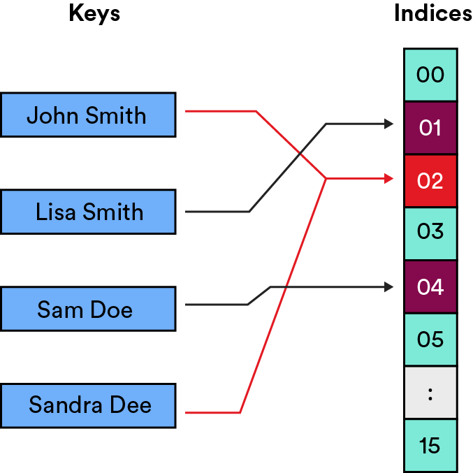
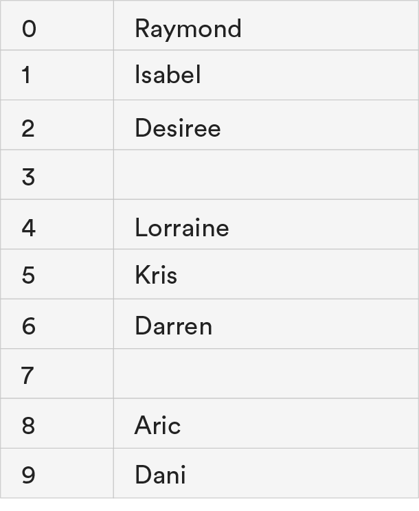
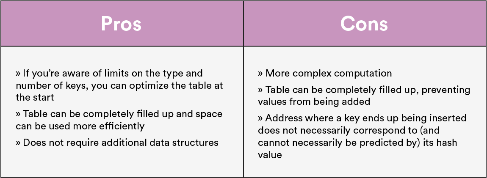

# Hash Tables Deep Dive

We miss our friends in Memoryville already, but it’s time to return to the real world. In this lesson, we’ll review hash tables, hash functions, and common uses of the data structure. We’ll even do some coding!

### TOPICS

- Hash Tables Recap
- Open and Closed Addressing
- Uses for Hash Tables

# Learning Objectives

By the end of this lesson, you'll be able to:

- Define hash tables, hash functions, and collisions.
- Explain when you would use open addressing or closed addressing to resolve collisions.
- Identify the implementations of hash tables in programming.

# Taking a Step Back

Before we begin, let’s define the term `hashing`. It’s a concept that appears in slightly different contexts throughout computer science, with slightly different definitions each time. But at its most basic, hashing refers to the process of taking a key (i.e., a piece of data), scrambling it with an algorithm, and producing an index that’s used to sort the key into a hash table.

A **hash function** is the algorithm that scrambles keys in order to produce indices. And, unlike the other functions we’ve learned, hash functions can take lots of different forms! There’s only one absolute rule: **For the same input, the function should always return the same output**. The rest are just general guidelines to follow when creating a hash function:

- It should be simple and efficient.
- It should distribute values evenly throughout the hash table.
- It should avoid collisions.

# Knowledge Check

In Memoryville, what represented the keys (input data) and the indices, respectively?

- [ ] Keys were residents'names; indicies were street adresses.
- [ ] Keys were street addresse; indicies were residents' names.
- [ ] Keys were residents' names; indices were the number of moves they had to make to find their house.
- [ ] Keys were street addresses; indices were the number of moves they had to make to find their house

<strong>ANSWER</strong>

Keys were residents'names; indicies were street adresses.

Recall that we scrambled a person's name into an integer, which was then used to assign them to a house. The name was the key (the starting value) and the address was thhe index (where the value should go.)

# But What About Hash Tables?

This lesson is called “Hash Tables Deep Dive,” so we should probably talk about hash tables, right?

A **hash table** is a list-like data structure that’s designed to quickly store and retrieve key data records. To store keys in a hash table, they must be mapped (with a hash function) to the set of possible indices in the table or to addresses of a memory location. In Memoryville, these were the housing developments to which we assigned residents. If we were creating a hash table with people’s names, it would look like this:

# Knowledge Check

You want to store a set of 100 employee records using each individual’s phone number.

Describe how you’d approach this situation using a hash function and a hash table.

<strong>ANSWER</strong>

Here’s how we broke it down:

- The phone numbers are keys, and we want to give each phone number (i.e., each employee) an index in order to sort them into the hash table.
- Create a hash function to generate an index between `0` and `99` for each phone number.
- Return the index for each phone number.
- Insert each phone number at its given index in the table.

# Where It Starts to Get Sticky

Remember, the one rule of a hash function is that, **for the same input, it must always generate the same output**.

However, two different inputs could have the same output — that’s not part of the rule! This is a common problem you’ll encounter in the hashing world, and it’s called a **collision**. (When Julie and Nora crashed on their way to their new houses in Memoryville, that was a collision.)

As a good programmer, you know that you need to provide a solution to collisions in your implementation. It’s your duty! There are two main methods of resolution:

- **Open addressing** (aka, probing).
- **Closed addressing** (aka, chaining).

# The Many Probing Methods of Open Addressing

The basic concept of open addressing: If the index generated for a key is already taken, jump to somewhere else in the table to store your key. This process is also called **probing**. The three most common types of open addressing are **linear probing**, **quadratic probing**, and **double hashing** (which we’ll get into next).

But why would we use open addressing?

