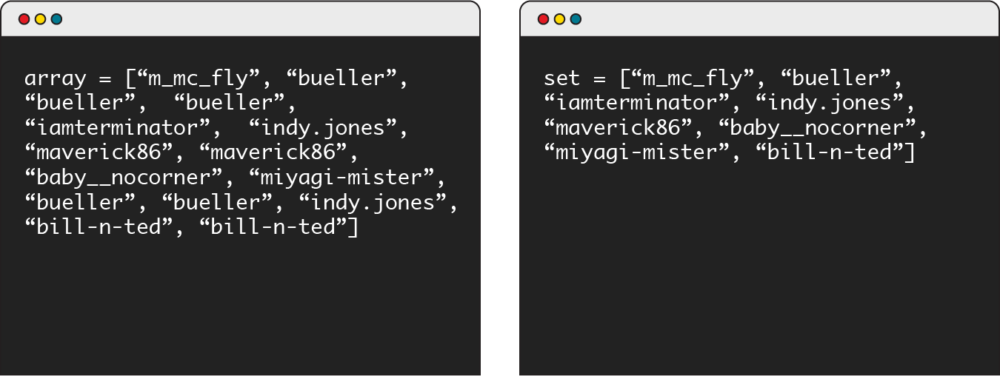
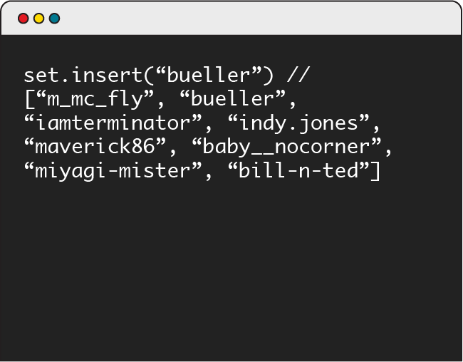
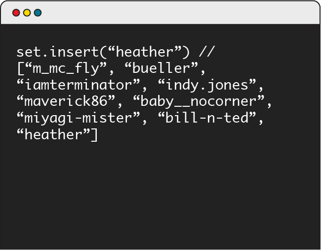

# Sets

Sets are simple, easy-to-understand data structures that operate a lot like arrays, only with one important plot twist. Are you intrigued yet? Read on!

### TOPICS

- What Is a Set?
- Working With Sets

# Learning Objectives

By the end of this lesson, you'll be able to:

- Define a set and how it’s used in programming.
- Distinguish between a set, an array, and a linked list.
- Implement sets and common methods used within them

# Setting the Stage

Most of the data structures we’ve covered so far are examples of list structures: includes arrays, linked lists, stacks, and queues.

Sets — the topic of this lesson — are also list structures. What makes them different? Well, where arrays are used to hold any sequence of values, sets are reserved for **sequences of unique values**.

Here’s how sets compare to some of the data structures we’ve already met:

| List type                                                               | Description                                                        |
| ----------------------------------------------------------------------- | ------------------------------------------------------------------ |
| **Array**                                                               | Any sequence of values.                                            |
| Linked list A list of values, stored in nodes, referencing other nodes. |
| **Stack**                                                               | A list of values in which the first item in is the last item out.  |
| **Queue**                                                               | A list of values in which the first item in is the first item out. |
| **Set**                                                                 | Any sequence of unique values.                                     |

# Meet the Set

You and your friend are going grocery shopping but don’t have much time. To shop faster, you want to split the items on the list and visit different parts of the store. The question here is, “Do we need to go to the dairy aisle at all? What about the bakery?”

This is where a set would come in handy. It could tell you whether or not yogurt is on the list, instead of how many containers of yogurt you need:

`set = ["loaf of bread", "yogurt", "carton of eggs", "lettuce", "scallions", "grapes", "tomato", "spaghetti"]`

When you get to the dairy aisle, you need to know exactly how many containers of yogurt to get. This is where an array would be useful:

`array = ["loaf of bread", "loaf of bread", "yogurt", "yogurt", "yogurt", "yogurt", "carton of eggs, "lettuce", "scallions", "grapes", "tomato", "tomato", "tomato", "spaghetti", "spaghetti"]`

# Why Sets?

Sets are useful when you’re dealing with a collection of items, but you **cannot have duplicates**. For example, they can be beneficial for storing:

- Unique usernames in your database.
- A unique list of tags on all of your blog posts.
- Customer names.

A set can store any type of data: numbers, Booleans, strings — even arrays or objects. The important thing, however, is that the collection of values is unique.

# Sets vs. Arrays

Let’s say you want to see all of the logins to your site from the past day.

An array (on the left) would show you all of the logins to the site in whatever order you wanted them structured (in this case, let’s say by time of login).

How many unique users logged in? Looking at the array, it’s hard to say exactly, as many users logged in multiple times. A set (on the right) would help!

Passing the same data set through a set object will automatically remove any duplicates for you. Now, it’s more obvious that eight unique users logged in to your site.

# Knowledge Check

Imagine that you wanted to add the value "bueller" to this set. Where would this get inserted?

- [ ] At the beginning.
- [ ] At the end.
- [ ] Nect to the other appearance of `"bueller"`
- [ ] It would'nt get added

<strong>ANSWER</strong>

<b>It wouldn't get added</b>

Because sets can only stor unique values, the data structure can detect whether or not he value you're trying to add is present. If the value is already in the set (like "bueller" is here), you won;t be able to add it again.

# Sets Do It For You

A set won’t allow you to add a value that’s already present. But, if you wanted to insert the user "heather" to this set you’d be able to, as it’s a new value! It would get added to the end of the set.

# Common Set Methods

The following methods are commonly built into sets:

| Method             | Description                                                                                                                         |
| ------------------ | ----------------------------------------------------------------------------------------------------------------------------------- |
| `.length`          | Returns the length of the set.                                                                                                      |
| `.insert(value)`   | Adds a value to the set, unless it’s already present.                                                                               |
| `.remove(value)`   | Removes and returns a value from the set.                                                                                           |
| `.has(value)`      | Returns true if the value is already in the set.                                                                                    |
| `.union(set)`      | Returns a new set comprising the union between two previous sets (i.e., the combined values of both sets).                          |
| `.intersect(set)`  | Returns a new set comprising the intersection between two previous sets (i.e., the values in both sets).                            |
| `.difference(set)` | Returns a new set comprising the difference between two sets (i.e., the values that only appeared in one of the two previous sets). |

# Hack Alert!

With the release of ES6 in 2015, JavaScript now includes a native set object you can use in most browsers, as well as Node.js. When you’re building your own applications in JavaScript, you can use this to quickly and easily create a set.

Given how recently they were added to the language, sets haven’t been widely adopted in JavaScript. By contrast, Python has had a native set object for a while, and you’ll see them used in a lot of Python web applications and in data science.

# Let’s Talk About Interviews

In a job interview, you might be asked to use some of the set methods we’ve looked at in this lesson. (You’ll have a chance to practice them on the next slide!)

If you’re hungry for more information on sets, take a dive deep [here](https://flaviocopes.com/javascript-data-structures-set/).

# Time to Practice

Now it’s your turn to implement a set in JavaScript! Use [this CodePen](https://codepen.io/GAmarketing/pen/gEOeZW?editors=1010) to implement a set and some of the common methods we mentioned earlier. You can check your work against the test script at the bottom.

Remember:

- Fork the Pen before making any edits.
- Don’t make any changes to the test script.
