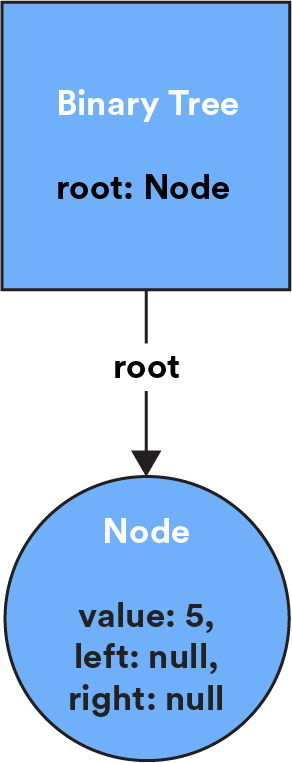

# Binary Trees and Tries

We’ve already learned about linked lists, a basic way to store data in nodes. Binary trees and tries are more advanced node-based structures that store data hierarchically from top to bottom (in the shape of, you guessed it, an actual tree). But here’s where we get fancy: Nodes in a binary tree or trie can point to more than one node! Let’s explore how this works.

### TOPICS

- Binary Trees
- Breadth- and Depth-First Traversal
- Tries

# First Things First: Trees

Before we get into the specifics of binary trees and tries, let’s start with your basic, run-of-the-mill tree data structure.

A **tree** is a collection of **nodes** (where data is stored) and **edges** (connections between nodes). They have some characteristics that are common across all species of trees (like a binary tree or trie) and set them apart from other node-based data structures:

- Each tree has a unique start node called the **root node**. (In a strange twist of fate, roots are usually drawn at the top of the tree — go figure!)
- Each node in a tree can only have one **parent node**. This is what gives trees their hierarchical structure. There’s only ever one path from a given node back to the root.
- Edges in a tree are sometimes referred to as **branches**.
- Nodes at the end of a tree that have no child nodes are called **leaves**.
- The length of the longest path from a leaf to the root is the tree’s **height**.

Long story short: Trees are unique and awesome data structures, and programmers love analogies.

# Trees in Action

Trees are used in situations where data needs to be stored hierarchically, retrieved easily, and use memory efficiently. You’re probably already familiar with quite a few tree data structures:

- **Basic file storage:** Any file is stored in a directory, and that directory is stored in another directory, and that hierarchy continues laddering up to the top.
- **Comment trees:** Where users can comment on comments.
- The way that calculators compute the **order of operations**.
- The **Document Object Model** (DOM) tree.
- **Data compression algorithms**.
- **Your March Madness bracket** (or any tournament that uses a bracket elimination system).

Let’s see how Drake has used a tree data structure to store data that relied on hierarchy and organization.

# Trees in Action

(video)

- Transcript

At my startup where I worked, it was a big thing that we wanted to classify industries. For example, if you’re aerospace and defense. Or are you plastic injection molding? Or are you manufacturing? Or something else? We had a bunch of industries. Some of them were hierarchical with subclasses of industries. A tree data structure is really good if that’s the kind of data that you want to structure. And if you want to find the parent class of a particular industry, what are all the child classes?

Somebody who knew what they were doing — a dev, or someone with experience — built this thing out with a lot of helper functions and some other modules that we used to interface with this thing. A junior dev might reasonably be expected to manipulate it or change one of these functions that scans a tree for a particular node. Or, they need to understand how a piece of code is operating, because they’re consuming the result or they might get a subtree.

You may not be solely in charge of working with one of these things, but you’ll probably have to read, understand, and maybe tweak some code.

#Binary Trees
A binary tree is a species of tree with one defining feature: Each node has at most two branches.

Each node, except for the root, will have three properties:

- The `value`, which describes the data in the node.
- The `left` property, which points to a node with a lesser value than the current node.
- The `right` property, which points to a node with greater value than the current node.

The `left` and `right` properties can also be set to `null` if the node has no child elements.

As we add new nodes to the binary tree, we use this logic to find each new node’s proper place in the structure: **lesser** values go **left**; **greater** values go **right**. (Remember this hint: lesser = left!)

